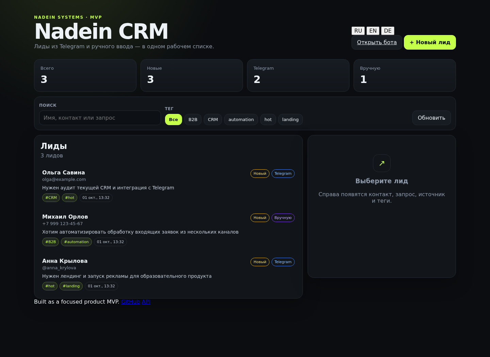
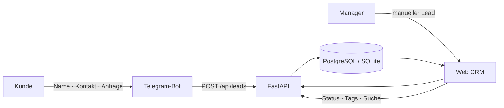

<p align="center"></p>

<p align="center"><a href="README.md">Русский</a> · <a href="README.en.md">English</a> · <a href="README.de.md"><b>Deutsch</b></a></p>

<p align="center">
  <a href="https://crm.aishka.su/"></a>
  <a href="https://t.me/nadein_crm_bot"></a>
  <a href="https://github.com/IgorNadein/nadein-crm/actions"></a>
</p>

# Nadein CRM

Eine kompakte CRM für Agenturen: Leads aus einem Telegram-Bot und manuell erfasste Anfragen landen in einem gemeinsamen Register. Manager können Leads suchen, den Status ändern, Tags vergeben und danach filtern.

Das Projekt ist ein funktionierendes **End-to-End-Web-MVP mit Telegram-Bot**, kein statisches Mockup.

### Direktlinks

| Ressource | URL |
|---|---|
| 🌐 Live CRM | https://crm.aishka.su/ |
| 🤖 Telegram-Bot | https://t.me/nadein_crm_bot |
| 📚 OpenAPI | https://crm.aishka.su/docs |
| 🧪 CI | [GitHub Actions](https://github.com/IgorNadein/nadein-crm/actions) |

## Oberfläche

<p align="center">
  
</p>

## Funktionen

- **Telegram → CRM:** Der Bot sammelt Name, Kontakt und Anfrage und erstellt über die gemeinsame API einen Lead.
- **Manuelle Lead-Erfassung** direkt im Web-Interface.
- **Tags & Filter** mit mehreren Tags pro Lead.
- **Suche** nach Name, Kontakt oder Anfrage.
- **Pipeline-Status:** `new → in_progress → won/lost`.
- **Metriken:** Gesamt / Neu / Telegram / Manuell.
- **Idempotente Verarbeitung** über `external_id`.
- **3 UI-Sprachen:** Russisch, Englisch und Deutsch; die Auswahl wird im Browser gespeichert.
- **Docker + PostgreSQL** für einen produktionsnahen lokalen Start.
- **Tests + CI** mit pytest und GitHub Actions.

## End-to-End-Ablauf



## Technologie

`Python` · `FastAPI` · `SQLAlchemy` · `Pydantic` · `aiogram` · `PostgreSQL` · `SQLite` · `Docker Compose` · `GitHub Actions` · `Cloudflare Tunnel`

## Schnellstart

```bash
python -m venv .venv
source .venv/bin/activate
pip install -e '.[dev]'
uvicorn app.main:app --reload
```

CRM: `http://localhost:8000` · Swagger: `http://localhost:8000/docs`

Telegram-Bot:

```bash
export BOT_TOKEN='<telegram-bot-token>'
export API_URL='http://localhost:8000'
python -m bot.main
```

### Docker / PostgreSQL

```bash
docker compose up --build
BOT_TOKEN='<telegram-bot-token>' docker compose --profile telegram up --build
```

## Wichtige MVP-Entscheidungen

**Eine API für alle Quellen.** Telegram-Bot und Web-UI verwenden denselben `LeadCreate`-Vertrag.

**Idempotenz am Ingestion-Rand.** `external_id` verhindert doppelte Leads bei erneut zugestellten Nachrichten.

**Normalisierte Many-to-Many-Tags.** Dadurch bleiben Filter vorhersehbar und die Datenstruktur erweiterbar.

**Normales Telegram liegt bewusst außerhalb des Pflicht-MVPs.** Der nächste Adapter würde MTProto verwenden und Nachrichten in denselben API-Vertrag normalisieren; siehe [Product Outline](docs/product.md).

## Dokumentation

- [Produktentwurf](docs/product.md)
- [Implementierung & AI-Tools](docs/implementation.md)
- [Demo Deployment](docs/deployment.md)
- [Abgabe des Testprojekts](SUBMISSION.md)

---
<p align="center"><sub>Built by <a href="https://github.com/IgorNadein">Igor Nadein</a> · Nadein Systems</sub></p>
