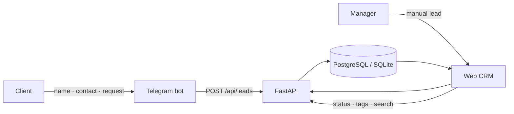

<p align="center"></p>

<p align="center"><a href="README.md">Русский</a> · <a href="README.en.md"><b>English</b></a> · <a href="README.de.md">Deutsch</a></p>

<p align="center">
  <a href="https://crm.aishka.su/"></a>
  <a href="https://t.me/nadein_crm_bot"></a>
  <a href="https://github.com/IgorNadein/nadein-crm/actions"></a>
</p>

# Nadein CRM

A compact agency CRM that brings Telegram and manually entered leads into one registry. Managers can search leads, update pipeline status, assign tags and filter by them.

This is a working **end-to-end web MVP + Telegram bot**, not a static mockup.

### Quick links

| Resource | URL |
|---|---|
| 🌐 Live CRM | https://crm.aishka.su/ |
| 🤖 Telegram bot | https://t.me/nadein_crm_bot |
| 📚 OpenAPI | https://crm.aishka.su/docs |
| 🧪 CI | [GitHub Actions](https://github.com/IgorNadein/nadein-crm/actions) |

## Features

- **Telegram → CRM:** bot collects name, contact and request and creates a lead through the shared API.
- **Manual lead entry** from the web UI.
- **Tags & filtering** with multiple tags per lead.
- **Search** by name, contact or request text.
- **Pipeline statuses:** `new → in_progress → won/lost`.
- **Metrics:** total / new / Telegram / manual.
- **Idempotent ingestion** via `external_id`.
- **3 UI languages:** Russian, English and German; preference persists in the browser.
- **Docker + PostgreSQL** for a production-like local setup.
- **Tests + CI** with pytest and GitHub Actions.

## End-to-end flow



## Architecture

```text
nadein-crm/
├── app/
│   ├── main.py          # FastAPI + API + static CRM
│   ├── models.py        # Lead, Tag, many-to-many
│   ├── schemas.py       # Pydantic contracts
│   └── static/          # RU / EN / DE web UI
├── bot/
│   └── main.py          # aiogram FSM → API
├── tests/               # API / idempotency / tags / metrics
├── docs/                # product, implementation, deployment
├── Dockerfile
└── docker-compose.yml
```

## Stack

`Python` · `FastAPI` · `SQLAlchemy` · `Pydantic` · `aiogram` · `PostgreSQL` · `SQLite` · `Docker Compose` · `GitHub Actions` · `Cloudflare Tunnel`

## Quick start

```bash
python -m venv .venv
source .venv/bin/activate
pip install -e '.[dev]'
uvicorn app.main:app --reload
```

CRM: `http://localhost:8000` · Swagger: `http://localhost:8000/docs`

Telegram bot:

```bash
export BOT_TOKEN='<telegram-bot-token>'
export API_URL='http://localhost:8000'
python -m bot.main
```

### Docker / PostgreSQL

```bash
docker compose up --build
BOT_TOKEN='<telegram-bot-token>' docker compose --profile telegram up --build
```

## API

| Method | Endpoint | Purpose |
|---|---|---|
| `POST` | `/api/leads` | Create a lead |
| `GET` | `/api/leads` | List, search and filter |
| `PUT` | `/api/leads/{id}/tags` | Replace tags |
| `PATCH` | `/api/leads/{id}/status` | Update status |
| `GET` | `/api/tags` | List tags |
| `GET` | `/api/metrics` | CRM counters |
| `GET` | `/api/health` | Healthcheck |

## Key MVP decisions

**One API for every ingestion source.** Telegram and the web UI use the same `LeadCreate` contract instead of writing to the database directly.

**Idempotency at the ingestion boundary.** `external_id` makes message re-delivery safe and prevents duplicate leads.

**Normalized many-to-many tags.** More structure than CSV-in-a-column, but predictable filtering and room to grow.

**Regular Telegram is deliberately out of the mandatory MVP.** The next adapter would use MTProto and normalize messages into the same API contract; see [product outline](docs/product.md).

## Documentation

- [Product outline](docs/product.md)
- [Implementation & AI tooling notes](docs/implementation.md)
- [Demo deployment](docs/deployment.md)
- [Test-task submission](SUBMISSION.md)

---
<p align="center"><sub>Built by <a href="https://github.com/IgorNadein">Igor Nadein</a> · Nadein Systems</sub></p>
