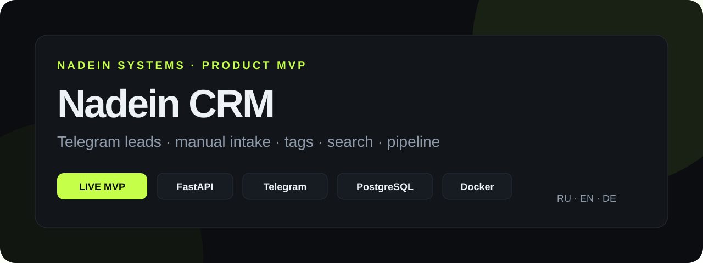
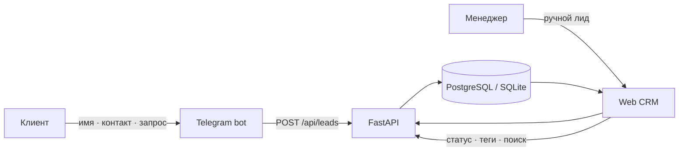

<p align="center">
  
</p>

<p align="center">
  <a href="README.md"><b>Русский</b></a> ·
  <a href="README.en.md">English</a> ·
  <a href="README.de.md">Deutsch</a>
</p>

<p align="center">
  <a href="https://crm.aishka.su/"></a>
  <a href="https://t.me/nadein_crm_bot"></a>
  <a href="https://github.com/IgorNadein/nadein-crm/actions"></a>
</p>

# Nadein CRM

Компактная CRM для агентства: заявки из Telegram-бота и ручного ввода попадают в единый реестр, где менеджер может искать лиды, менять статус, назначать теги и фильтровать по ним.

Это не макет: **web-MVP и Telegram-бот работают end-to-end**.

### Быстрые ссылки

| Ресурс | Ссылка |
|---|---|
| 🌐 Live CRM | https://crm.aishka.su/ |
| 🤖 Telegram bot | https://t.me/nadein_crm_bot |
| 📚 OpenAPI | https://crm.aishka.su/docs |
| 🧪 CI | [GitHub Actions](https://github.com/IgorNadein/nadein-crm/actions) |
| 📝 Тестовое задание | [SUBMISSION.md](SUBMISSION.md) |

## Что умеет

- **Telegram → CRM:** бот собирает имя, контакт и запрос и создаёт лид через единый API.
- **Ручное создание:** менеджер может добавить лид из web-интерфейса.
- **Теги и фильтры:** несколько тегов на лид, фильтрация по тегу.
- **Поиск:** по имени, контакту и тексту запроса.
- **Статусы:** `new → in_progress → won/lost`.
- **Метрики:** всего / новые / Telegram / вручную.
- **Идемпотентность:** `external_id` защищает от дублей при повторной доставке.
- **Интерфейс на 3 языках:** русский, английский и немецкий с сохранением выбора в браузере.
- **Docker + PostgreSQL:** локальный production-like запуск через Compose.
- **Тесты и CI:** основной API-сценарий покрыт pytest и проверяется GitHub Actions.

## Сквозной сценарий



## Архитектура

```text
nadein-crm/
├── app/
│   ├── main.py          # FastAPI + API + static CRM
│   ├── models.py        # Lead, Tag, many-to-many
│   ├── schemas.py       # Pydantic contracts
│   └── static/          # RU / EN / DE web UI
├── bot/
│   └── main.py          # aiogram FSM → API
├── tests/               # API / idempotency / tags / metrics
├── docs/                # product, implementation, deployment
├── Dockerfile
└── docker-compose.yml
```

## Технологии

`Python` · `FastAPI` · `SQLAlchemy` · `Pydantic` · `aiogram` · `PostgreSQL` · `SQLite` · `Docker Compose` · `GitHub Actions` · `Cloudflare Tunnel`

## Быстрый запуск

```bash
python -m venv .venv
source .venv/bin/activate
pip install -e '.[dev]'
uvicorn app.main:app --reload
```

CRM откроется на `http://localhost:8000`, Swagger — на `http://localhost:8000/docs`.

Для Telegram-бота:

```bash
export BOT_TOKEN='<telegram-bot-token>'
export API_URL='http://localhost:8000'
python -m bot.main
```

### Docker / PostgreSQL

```bash
docker compose up --build
```

С Telegram worker:

```bash
BOT_TOKEN='<telegram-bot-token>' docker compose --profile telegram up --build
```

## API

| Метод | Endpoint | Назначение |
|---|---|---|
| `POST` | `/api/leads` | Создать лид |
| `GET` | `/api/leads` | Список, поиск и фильтрация |
| `PUT` | `/api/leads/{id}/tags` | Назначить теги |
| `PATCH` | `/api/leads/{id}/status` | Изменить статус |
| `GET` | `/api/tags` | Список тегов |
| `GET` | `/api/metrics` | Счётчики CRM |
| `GET` | `/api/health` | Healthcheck |

## Проверки

```bash
python -m py_compile app/*.py bot/*.py
pytest
```

GitHub Actions выполняет обе проверки на каждом push и pull request.

## Решения, принятые для MVP

**Один API для всех источников.** Telegram-бот и web-интерфейс не пишут в БД напрямую — оба используют единый контракт `LeadCreate`. Это оставляет место для email, webhook и обычного Telegram без размножения бизнес-логики.

**Идемпотентность на границе ingestion.** `external_id` позволяет безопасно повторять доставку сообщения и не создавать дубли.

**Теги — отдельная many-to-many модель.** Это чуть сложнее строки с CSV, зато фильтрация остаётся нормализованной и расширяемой.

**Обычный Telegram сознательно не вошёл в обязательный MVP.** Для него предусмотрен отдельный MTProto ingestion-адаптер; детали описаны в [product outline](docs/product.md).

## Документация

- [Набросок продукта](docs/product.md)
- [Разбор реализации и AI-инструментов](docs/implementation.md)
- [Demo deployment](docs/deployment.md)
- [Формат сдачи тестового](SUBMISSION.md)

---

<p align="center"><sub>Built by <a href="https://github.com/IgorNadein">Igor Nadein</a> · Nadein Systems</sub></p>
