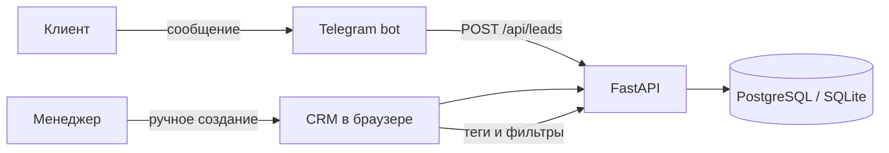

# Набросок продукта

## Проблема и аудитория

Небольшому агентству неудобно терять заявки между Telegram, личными сообщениями и ручными заметками. Менеджеру нужен единый список лидов, где видно источник, контакт, запрос и простую классификацию по тегам.

`Nadein CRM` — минимальная CRM для такого агентства. Она не пытается заменить полноценные продажи и аналитику: задача MVP — доказать сквозной сценарий **сообщение боту → структурированная заявка → лид в CRM → тег → фильтрация**.

## Контур

## Что входит в MVP

- Telegram-бот собирает имя, контакт и запрос и создаёт лид через API.
- CRM показывает лиды из Telegram и созданные вручную.
- Лида можно создать вручную в браузере.
- Лиду можно присвоить один или несколько тегов.
- Список можно фильтровать по тегам и искать по имени, контакту или запросу.
- Для демонстрации добавлены статусы и простые метрики по источникам.

## Что сознательно оставлено за рамками

- Авторизация и роли: для трёхдневного демо это не влияет на проверяемый сценарий; в production добавил бы SSO/RBAC.
- Полноценная воронка, задачи, комментарии, файлы и аудит изменений.
- Интеграция обычного пользовательского Telegram. Для неё нужен MTProto-клиент (например, Telethon), пользовательская сессия и отдельная политика хранения/обработки личных сообщений. Я бы сделал отдельный ingestion-service: новые входящие сообщения нормализуются в тот же `LeadCreate`, дедуплицируются по `chat_id/message_id` и попадают в общий API.
